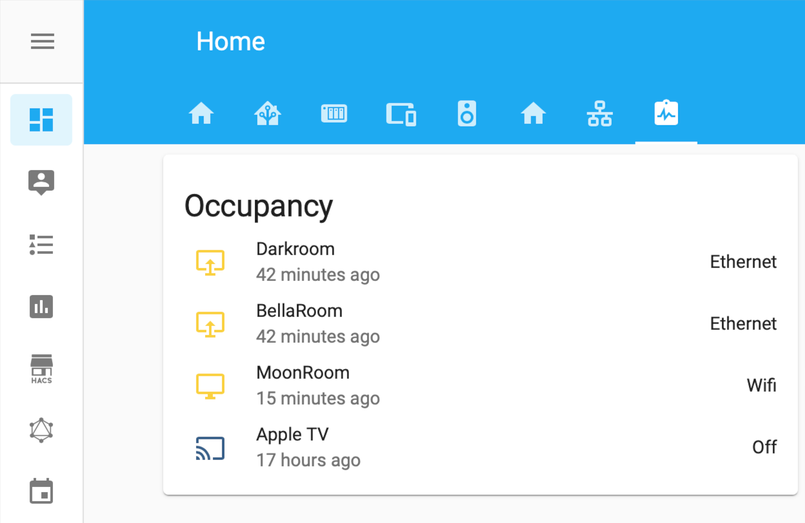
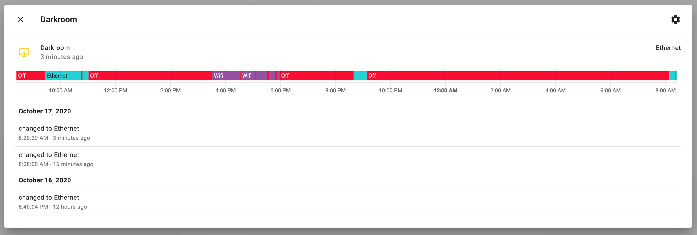

# Mac Occupancy Template #

I'm using the [Home Assistant Mac App](https://www.home-assistant.io/blog/2020/09/18/mac-companion/). I love to use the active, facetime camera, connection type and mic sensor for my automation. 

This information can permit HA to know if the laptop is used in the office or not.
For example, turn on the light office if mac is active and connected on to my monitor.

So I decided to play with the template and the unifi sensor of the mac to achieve this target.

The template sensor has 4 states:
- Desk: Mac active and connected to my monitor
- Wifi: Mac active and connected to home wifi
- Offsite: Mac active and connected outside of the home
- Off: Mac not active





configuration.yaml
``` yml
# computer mac_occupancy
- platform: template
  sensors:
    fastroom_occupancy:
      friendly_name: "Fastroom Occupency"
      value_template: >-
        
          
            Desk
          
            Wifi
          
            Offsite
          
        
          Off
        
      icon_template: >-
        
          
            mdi:monitor-share
          
            mdi:monitor
          
            mdi:monitor-off
          
        
          mdi:monitor-off
        

```

There is a similar template for the Apple TV usage using the [Apple TV integration](https://www.home-assistant.io/integrations/apple_tv/).

```yml
# apple_tv_occupancy
- platform: template
  sensors:
    apple_tv_occupancy:
      friendly_name: "Apple TV"
      value_template: >-
        
          Playing
        
          Off
        
      icon_template: >-
        
          mdi:cast-connected
        
          mdi:cast
        
```


If you are using [custom-ui](https://github.com/Mariusthvdb/custom-ui), you can change the colour of the icon base on the status.

customize_glob.yaml
``` yml
# sensor template for mac
sensor.*_occupancy:
  templates:
    icon_color: >
      if (state === 'Desk') return 'rgb(251, 210, 41)';
      if (state === 'Wifi') return 'rgb(251, 210, 41)';
      if (state === 'Playing') return 'rgb(251, 210, 41)';      
      return 'rgb(54, 95, 140)';
```
