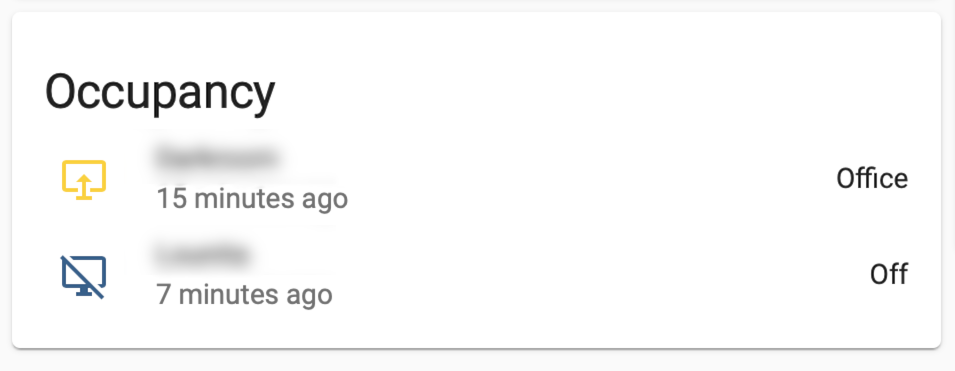
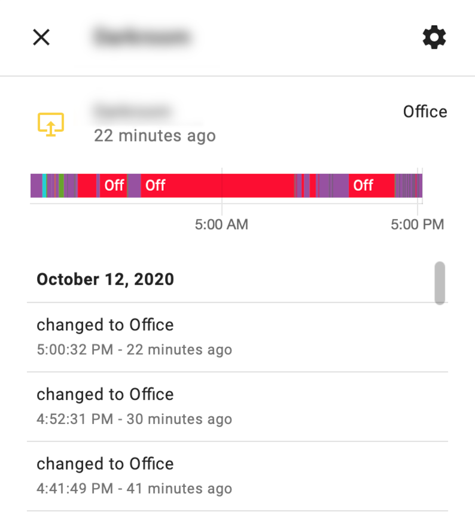

# Mac Occupancy Template#

I'm using the [Home Assistant Mac App](https://www.home-assistant.io/blog/2020/09/18/mac-companion/). I love to use the active, facetime camera, and mic sensor for my automation. Unfortunately for now, the current sensors don't permit to know if the Mac connected over ethernet cable.

This information can permit HA to know if the laptop is used in the office or not.
For example, turn on the light office if mac is active and connected on ethernet.

So I decided to play with the template and the unifi sensor of the mac to achieve this target.

The template sensor has 4 states:
- Office: Mac active and connected over ethernet
- Home: Mac active and connected to home wifi
- Offsite: Mac active and connected outside of the home
- Off: Mac not active

It's not perfect due to a delay of the unifi sensor to find the Mac isn't connected by ethernet. Ideally, the Mac app companion will have a [ethernet sensor](https://github.com/home-assistant/iOS/issues/1184).






configuration.yaml
``` yml
# computer mac_occupancy
- platform: template
  sensors:
    mac_occupancy:
      friendly_name: "Mac"
      value_template: >-
        
          
            Office
          
            Home
          
            Offsite
          
        
          Offline
        
      icon_template: >-
        
          
            mdi:monitor-share
          
            mdi:monitor
          
            mdi:monitor-off
          
        
          mdi:monitor-off
        

```
if you are using [custom-ui](https://github.com/Mariusthvdb/custom-ui), you can insert this code:

customize_glob.yaml
``` yml
# sensor template for mac
sensor.*_occupancy:
  templates:
    icon_color: >
      if (state === 'Office') return 'rgb(251, 210, 41)';
      if (state === 'Home') return 'rgb(251, 210, 41)';
      return 'rgb(54, 95, 140)';
```
