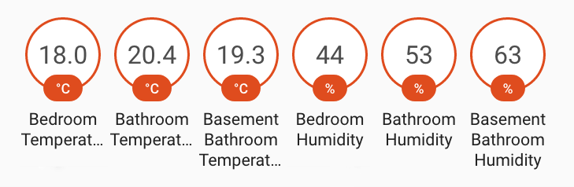

# Rounded sensors

Aqara sensors are delivery temperature and humidity data with too many decimals. For better readability in the Home Assistant's badges, I prefer to use rounded values. By default, HA doesn't permit us to do it via the interface.

I used the platform template for creating new sensors.

sensor.ymal
```yml
# rounded temperature sensors
- platform: template
  sensors:
    homelab_temperature_round:
      friendly_name: "Homelab Temperature"
      unit_of_measurement: '°C'
      value_template: "{{ (states('sensor.homelab_temperature') | float ) | round(1) }}"
      icon_template: mdi:thermometer

# rounded humidity sensors
- platform: template
  sensors:
    homelab_humidity_round:
      friendly_name: "Homelab Humidity"
      unit_of_measurement: '%'
      value_template: "{{ (states('sensor.homelab_humidity') | float ) | round(0) }}"
      icon_template: mdi:water-percent      

```

The result in my dashboard




If you are using InfluxDB for long term data storage, don't forget to exclude this new rounded sensors.

configuration.yaml
```yml
influxdb:
  host: !secret influxdb_host
  username: !secret influxdb_username
  password: !secret influxdb_password
  exclude:
    entity_globs:
     - sensor.*_round
```
