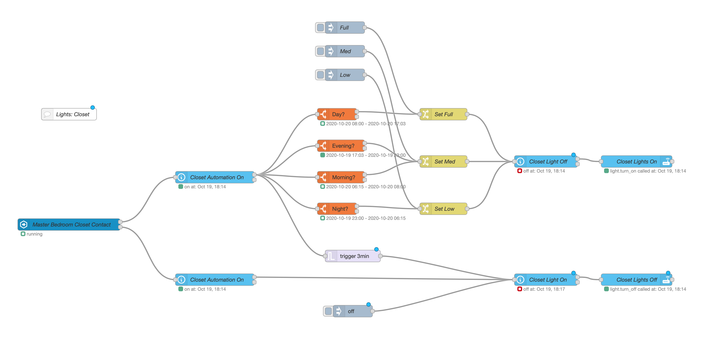

# Closet Light #

One of my first automation was to control the light of my closet with the door sensor (Aqara).
- [x] Door is open -> light go on
	(The intensity and colour temperature are control base time of the day and sunrise/sunset)
- [x] Door is close -> light go off
- [x] Door is open mode than 3 minutes -> light go off
- [x] Add an input boolean for turn off automation from HA, HomeKit and Siri
- [ ] Control light intensity form a luminosity sensor in the bedroom

Insert in the configuration.yaml
```yml
input_boolean:
   closet_automation:
      name: Closet Automation
      icon: mdi:home-automation
      initial: true
```

The code: 



Back to [NodeRed](../../README.md)
