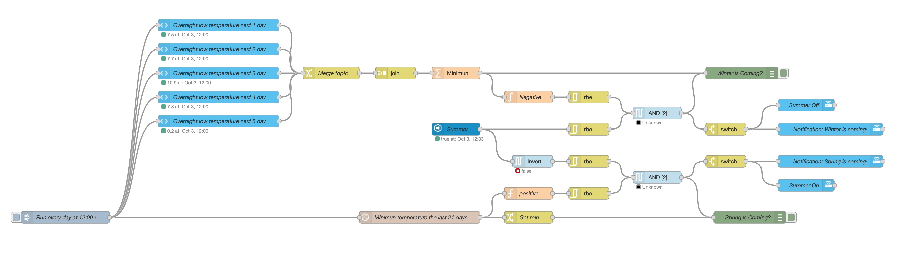

# Garden Winter & Spring Prep #

Winter is coming! :-).
I'm living in Quebec/Canada so winters are very cold.
The garden needs to be prepared for winter (watering hose, stair-rubbers,...) and spring too.
- [x] Winter is trigger if the Celsius temperature go negative the next  5 days (using dark sky integration)
- [x] Sprint is triggered if the temperature didn't go negative the last 20 days (using long storage data in InfluxDB)

Insert in the configuration.yaml
```yml
input_boolean:
   summer:
      name: Summer
      icon: mdi:white-balance-sunny
```

The code: 



Back to [NodeRed](../../README.md)
