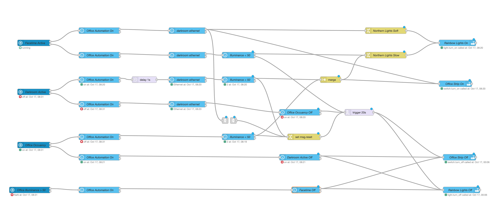

# Office Light #

My office lights are control by a motion sensor (Aqara) and Home Assistant (HA) Mac App activity sensor.
In the case of usage of my webcam (Zoom, Skype,..), my Aurora light is less saturated colour. When the webcam finishes being used, the Aurora light is back to saturated.
- [x] Motion sensor On -> Turn on the lights
- [x] HA Mac App activity sensor On -> Turn on the lights
- [x] Motion sensor Off and HA Mac App activity sensor Off for 20 seconds -> Turn off the lights
- [x] Add an input boolean for turn off automation from HA, HomeKit and Siri
- [x] Add illumination to the automation. If illumination is over 50 lux, the light isn't turn on
- [x] Check presence on the mac in office with 
- [ ] Control an On-Air light outside of the office base mic usage on the computer
- [ ] Add variable for set illumination trigger value

Insert in the configuration.yaml
```yml
input_boolean:
   office_automation:
      name: Office Automation
      icon: mdi:home-automation
      initial: true
```

The code: 



Back to [NodeRed](../../README.md)
