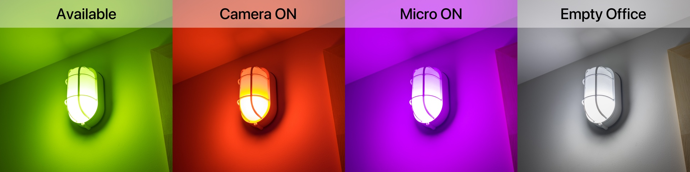
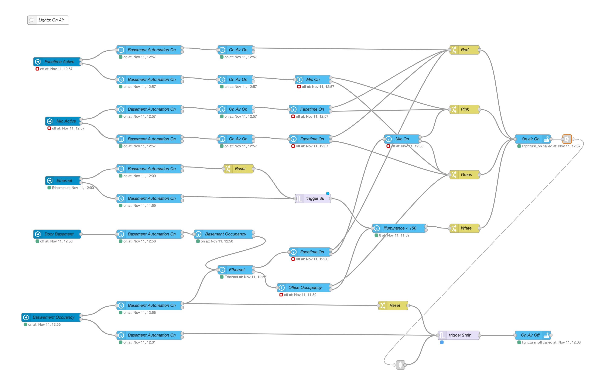

# On Air Light #

Working from home is here to stay for a long while, like countless on-line meetings. As a result my office door is almost always closed and I barely see my family, even if we are all present at the same time in the same house, because they never know if it’s ok to step inside.

So I have  created an "On Air" Light to notify outside of my office the current status with RGB light. The hardware part was very cheap and easy to do. I learned electrical installation during my last home renovation with my handy-man. I'm living in Canada, so your electrical code may be different in your country.

WARNING! If you are not comfortable with electricity, use a professional electrician.


- [X] [An Ikea TRÅDFRI LED bulb E26 600 lumen](https://www.ikea.com/ca/en/p/tradfri-led-bulb-e26-600-lumen-wireless-dimmable-color-and-white-spectrum-color-and-white-spectrum-globe-opal-white-90408617/): Color Zigbee LED bulb with 600 lumen
- [X] [Outdoor Wall Lantern - Nautical](https://www.rona.ca/en/outdoor-wall-lantern-nautical-0511193): Light not my best choice but cheap :-)
- [x] [Outlet Box ](https://www.renodepot.com/en/outlet-box-0320005) : Inside the wall behind the light
- [x] [NMD90 Construction Wire ](https://www.rona.ca/en/canada-wire-nmd90-construction-wire-47174810-1798001)  Classical wire for US/Canada electrical
- [X] [Aqara Motion sensor](https://www.aqara.com/en/human_motion_sensor.html): To get motion in the office and the basement
- [X] [Aqara door sensor](https://www.aqara.com/en/door_and_window_sensor.html): To get the status open/close of the basement door

By chance, I have a light switch on the other side of the wall. Only a short cable and no hole was needed, except for the Outlet Box.

For the software side, the[Home Assistant Mac Companion](https://www.home-assistant.io/blog/2020/09/18/mac-companion/) gives me very useful sensors like FaceTime camera and micro. For the Mac presence in the room, I'm using my [Mac Occupancy Template](../../../HomeAssistant/macOccupancyTemplate) to know if my Mac is connected to the ethernet. Aqara sensors are connected to [Home Assistant](https://registry.hub.docker.com/r/homeassistant/home-assistant) via [Zigbee2mqtt](https://registry.hub.docker.com/r/koenkk/zigbee2mqtt) and [Mosquito](https://registry.hub.docker.com/_/eclipse-mosquitto/).

For more detail of my configuration, I invite you to check my [Software](software.md) and [Hardware](hardware.md) pages.

The "On Air" light is only turned on when someone is opening or closing the basement door or the motion sensor in the basement got triggered. The office is considered empty if the computer isn't connected to ethernet and the office's motion sensor is clear.

The light changes color based on the status of the different sensors:

- [x] Green: the computer is connected to ethernet and not using this camera and micro
- [x] Red: the computer is connected to ethernet and the camera is used
- [x] Pink: the computer is connected to ethernet and micro is used
- [x] White: the office is empty and basement's illumination is below 150 lux

As for all my automation, I created an input boolean for turn off automation from HA, HomeKit, and Siri

Insert in the configuration.yaml
```yml
input_boolean:
   on_air_automation:
      name: On Air Automation
      icon: mdi:home-automation
      initial: true
```



The code: 



Back to [NodeRed](../../README.md)
