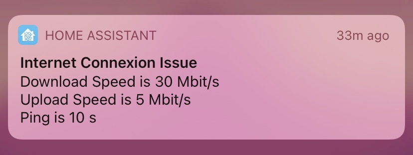
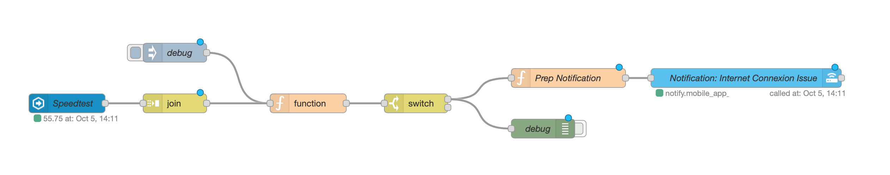

# Internet Connexion Issue Notification #

This automation checks after every SpeedTest done by Home Assistant SpeedTest integration.
- [x] If the download speed is below a value
- [x] If the upload speed is below a value
- [x] If the ping is over a value
- [x] In case of issue a iOS notification is send
- [x] With 'apns-collapse-id' the new notification will be replace the old one

The code: 

Back to [NodeRed](../../README.md)
