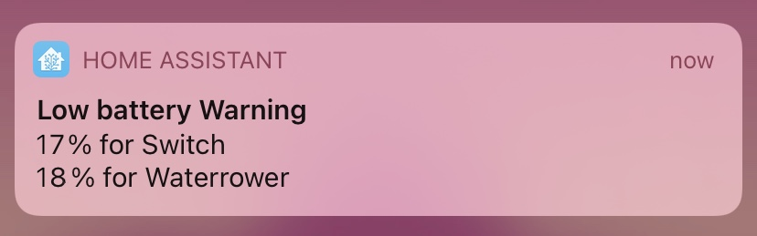
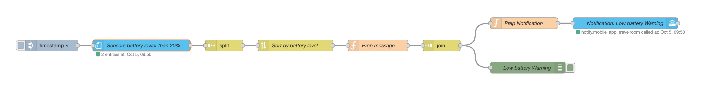

# Low Batteries Sensors Notification #

This automation checks every day the battery level of all the sensors. If some sensors percentage are below 20%, Node-Red will send one notification.
These 8 nodes permit to avoid creating one automation for each sensor.
- [x] Add sorting message by ascending battery level
- [x] Reformat message "battery" for "sensor"

The code: 

Back to [NodeRed](../../README.md)
