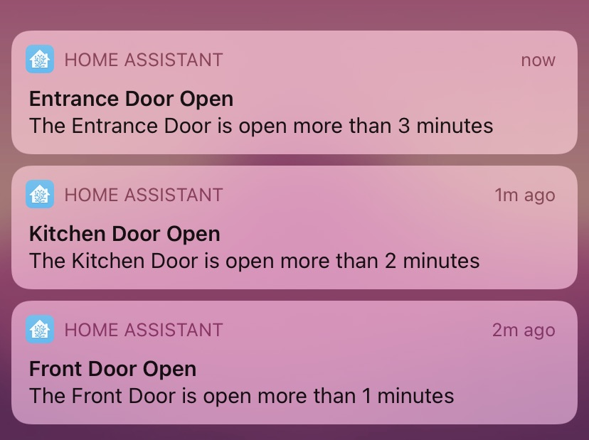
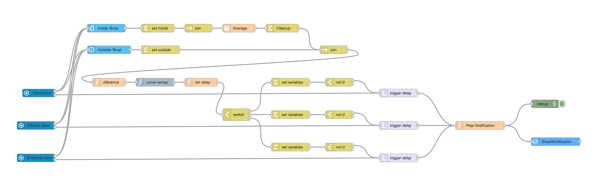

# Open Door Notification #

This automation checks if the outside doors aren't open for too long time. Each door have is own delay base on the difference of outside temperature and average of inside temperatures. This information is stored at the flow level.

Before Node Red 1.2, the trigger node can't accept variable for delay, so I played with the switch node and many trigger nodes. But now, it's possible, so my flow it's much more simple. 

- [x] When a door open, the flow calculate the difference of outside temperature (from Dark Sky) and the average of inside temperatures
- [x] A delay is set for each door using a curve remapping form the difference. The value of 0 is used for avoiding notification
- [x] Send a notification if the door is open more than the delay
- [x] Don't send a notification if door is closed before the delay

The code: 

Back to [NodeRed](../../README.md)
