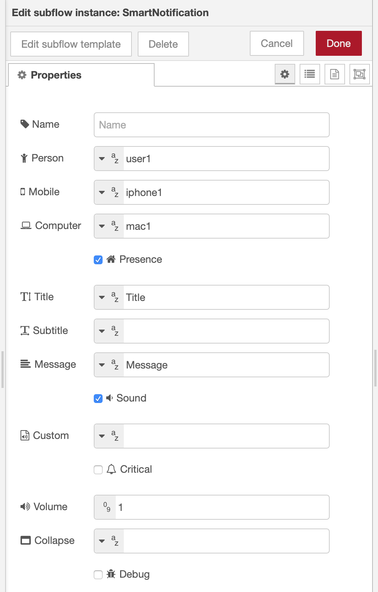
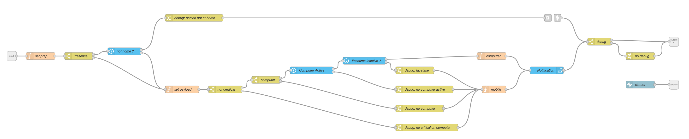
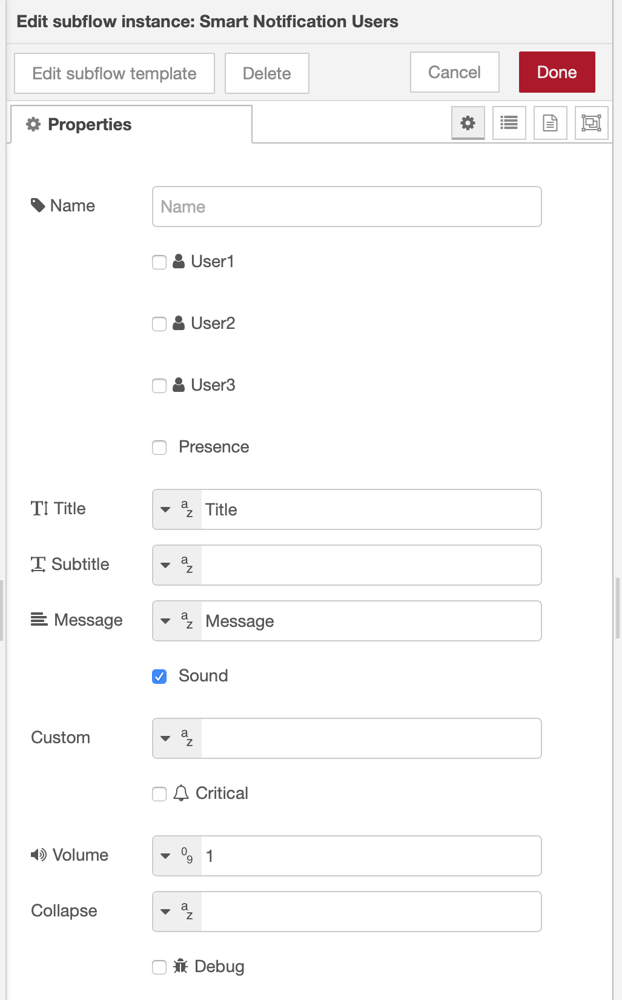
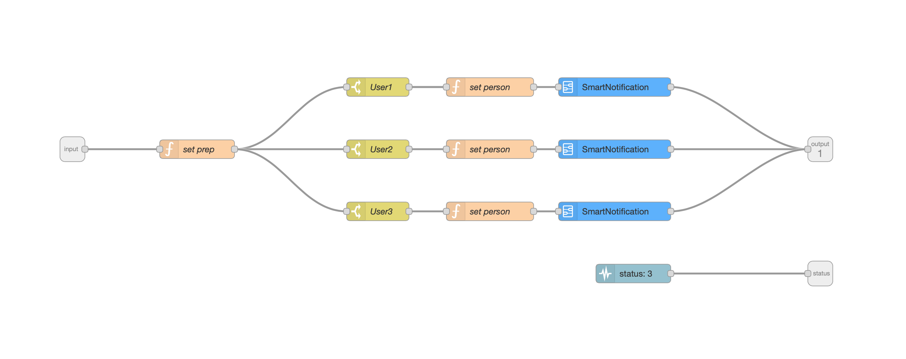
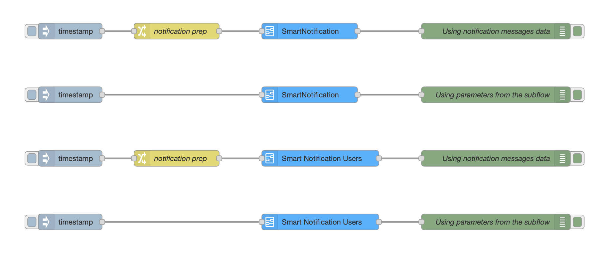

# Smart Notification Subflow#

## Smart Notification ##

This subflow permit to send a notification to the user without the need to deal with json. It only supports iPhone and Mac specificities. This graph adds some logical for presence, prioritize computer if it's currently used. It's possible to use the node by itself without any input, just change the parameters present on the subflow):

It's possible to pass some of the parameters using this structure.
You can only define the parameters you want to over-right.

- [x] Presence option -> No notification send if the user isn't at home
- [x] If the user on the computer -> Notification to computer
- [x] If the user is using the computer's webcam  -> Notification to the computer without sound
- [x] Critical -> Notification to mobile

### Options currently supported ###

- [x] Title
- [x] Subtitle
- [x] Message
- [x] Sound (on/off)
- [x] Custom sound
- [x] Critical (on/off)
- [x] Volume
- [x] Collapse

### Options to implement ###

- [ ] Grouping iOS Notifications
- [ ] Dynamic Attachments iOS Notifications
- [ ] Actionable iOS Notifications
- [ ] Did it missed something?

## Smart Notification Users##

This subflow permits to send notifications to multiple users. It similar to behaviour than SmartNotification

- [x] Currently support 3 users, just duplicate the nodes and do some renaming  

## Smart Notification Graph##

The code: 

Back to [NodeRed](../../README.md)
