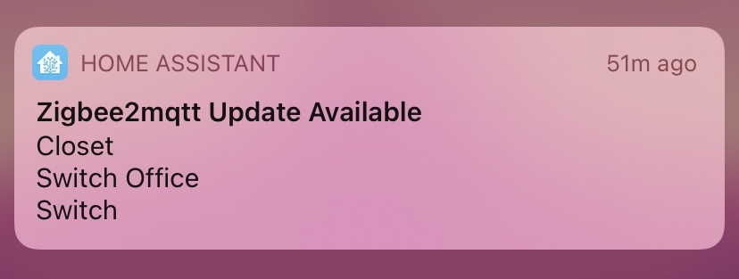
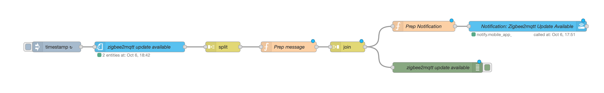

# Zigbee2mqtt Device Update Available Notification #

This very simple automation checks every day if Zigbee2mqtt devices have an update available and send an notification grouped in case is needed.

More detail for the update process itself, go to the  web site.

The code: 

Back to [NodeRed](../../README.md)
