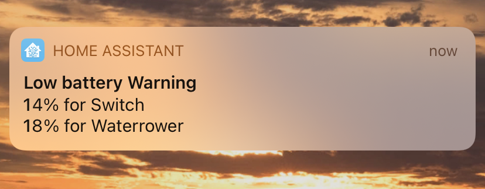
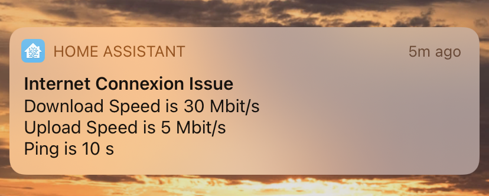
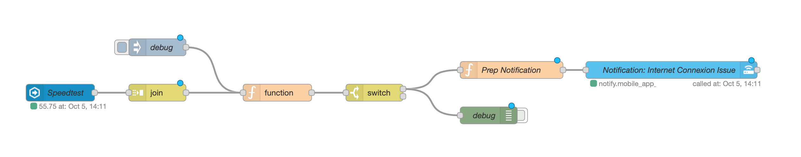
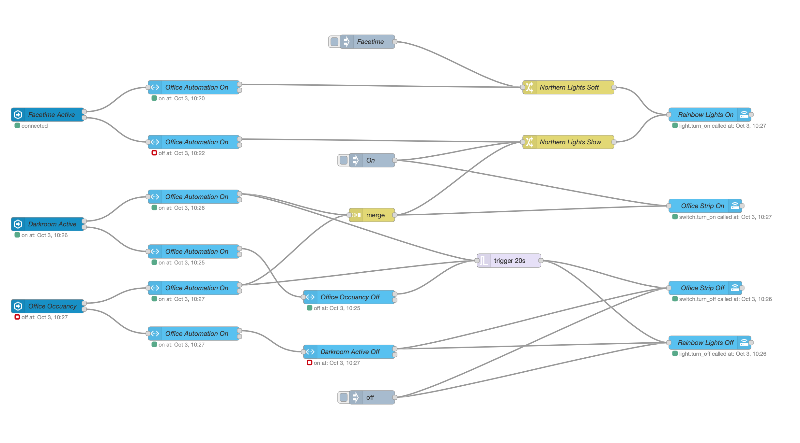
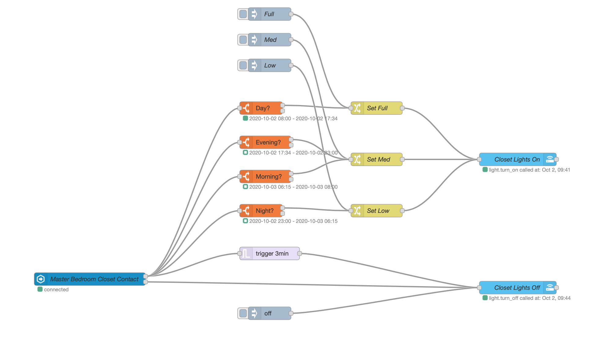
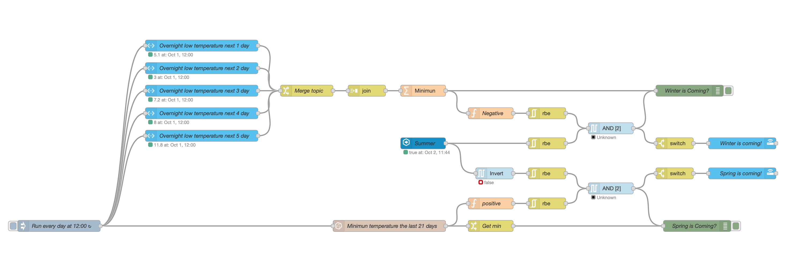

# Node-Red Automations #

All my simples automation are done in Home Assistant. But when it needs to be more complex, I'm using Node-Red. This application permits to build a graph very visual, close to Houdini, the VFX program I'm using for my work.

I decided to share my code to give some ideas or for maybe help some users. I don't have years of Node-Red experience, so I'm sure it possible to get better graph. Feel free to share your tips.

Thanks

### There is the list of my current flows ###
- [Low Batteries Sensors Notification](#low-batteries-sensors-notification)
- [Internet Connexion Issue Notification](#internet-connexion-issue-notification)
- [Office Light](#office-light)
- [Closet Light](#closet-light)
- [Garden Winter & Spring Prep](#garden-winter--spring-prep)


## Low Batteries Sensors Notification ##
This automation checks every day the level of the sensor battery. If the percentage is below 20%, Node-Red will send a notification.
These 8 nodes permit to avoid creating one automation for each sensor.
- [x] Add sorting message by ascending battery level
- [x] Reformat message "battery" for "sensor"



The code: 


## Internet Connexion Issue Notification ##
This automation checks after every SpeedTest done by Home Assistant SpeedTest integration.
- [x] If the download speed is below a value
- [x] If the upload speed is below a value
- [x] If the ping is over a value
- [x] In case of issue a iOS notification is send
- [x] With 'apns-collapse-id' the new notification will be replace the old one



The code: 



## Office Light ##
My office lights are control by a motion sensor (Aqara) and Home Assistant (HA) Mac App activity sensor.
In the case of usage of my webcam (Zoom, Skype,..), my Aurora light is less saturated colour. When the webcam finishes being used, the Aurora light is back to saturated.
- [x] Motion sensor On -> Turn on the lights
- [x] HA Mac App activity sensor On -> Turn on the lights
- [x] Motion sensor Off and HA Mac App activity sensor Off for 20 seconds -> Turn off the lights
- [x] Add an input boolean for turn off automation from HA, HomeKit and Siri
- [x] Add illumination to the automation. If illumination is over 50 lux, the light isn't turn on
- [ ] Control an On-Air light outside of the office base mic usage on the computer
- [ ] Add variable for set illumination trigger value

Insert in the configuration.yaml
```yml
input_boolean:
   office_automation:
      name: Office Automation
      icon: mdi:home-automation
      initial: true
```

The code: 



## Closet Light ##

One of my first automation was to control the light of my closet with the door sensor (Aqara).
- [x] Door is open -> light go on
	(The intensity and colour temperature are control base time of the day and sunrise/sunset)
- [x] Door is close -> light go off
- [x] Door is open mode than 3 minutes -> light go off
- [x] Add an input boolean for turn off automation from HA, HomeKit and Siri
- [ ] Control light intensity form a luminosity sensor in the bedroom

Insert in the configuration.yaml
```yml
input_boolean:
   closet_automation:
      name: Closet Automation
      icon: mdi:home-automation
      initial: true
```

The code: 



## Garden Winter & Spring Prep ##

Yes  Winter is coming! :-).
I'm living in Quebec/Canada so winters are very cold.
The garden needs to be prepared for winter (watering hose, stair-rubbers,...) and spring too.
- [x] Winter is trigger if the Celsius temperature go negative the next  5 days (using dark sky integration)
- [x] Sprint is triggered if the temperature didn't go negative the last 20 days (using long storage data in InfluxDB)

Insert in the configuration.yaml
```yml
input_boolean:
   summer:
      name: Summer
      icon: mdi:white-balance-sunny
```

The code: 


