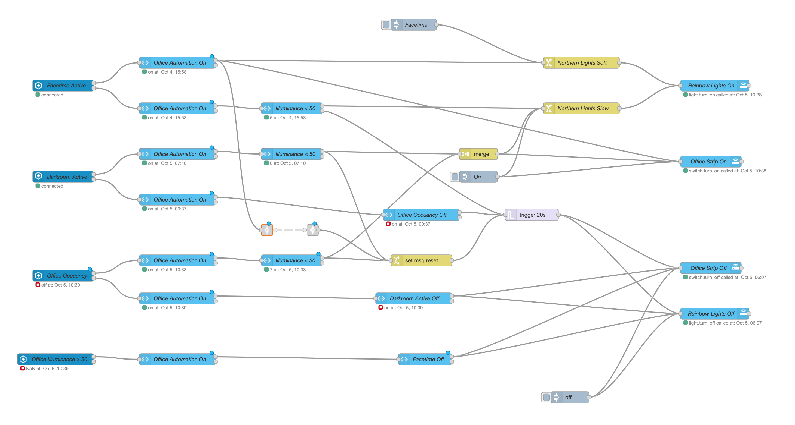

# Node-Red Automations #

All my simples automation are done in Home Assistant. But when it needs to be more complex, I'm using Node-Red. 
This application permits to build a graph very visual, close to Houdini, the VFX program I'm using for my work.

- [Office Light](#office-light)
- [Closet Light](#closet-light)
- [Garden Winter & Spring Prep](#garden-winter--spring-prep)

## Office Light ##
My office lights are control by a motion sensor (Aqara) and Home Assistant (HA) Mac App activity sensor. 
In the case of usage of my webcam (Zoom, Skype,..), my Aurora light is less saturated color. When the webcam finishes being used, the Aurora light is back to saturated.

My next plan is to have an "On-Air" red light outside of my office when my computer's micro is on.  
- [x] Motion sensor On -> Turn on the lights
- [x] HA Mac App activity sensor On -> Turn on the lights
- [x] Motion sensor Off and HA Mac App activity sensor Off -> Wait 20 seconds -> Turn off the lights
- [ ] Control an On-Air light outside of the office base mic usage on the computer

## Closet Light ##

One of my first automation was to control the light of my closet with the door sensor (Aqara).
- [x] Door is open -> light go on
	(The intensity and color temperature are control base time of the day and sunrise/sunset)
- [x]  Door is close -> light go off 
- [x]  Door is open mode than 3 minutes -> light go off 
- [ ] Control light intensity form a luminosity sensor in the bedroom

## Garden Winter & Spring Prep ##

I'm living in Quebec/Canada so winters are very cold. 
The garden needs to be prepared for winter and spring too.

### Winter ###
Winter si trigger is the Celsius temperature go negative the next  5 days (using dark sky integration)
- Watering hose needs to be removed (empty and store inside)
- Some plates go inside the house to survive
- Stair-rubbers are installed

### Spring ###
Sprint is triggered when the temperature didn't go negative the last 20 days (using long storage data in InfluxDB)
- Watering hose need to be install
- Some plates go outside
- Stair-rubbers are removed

