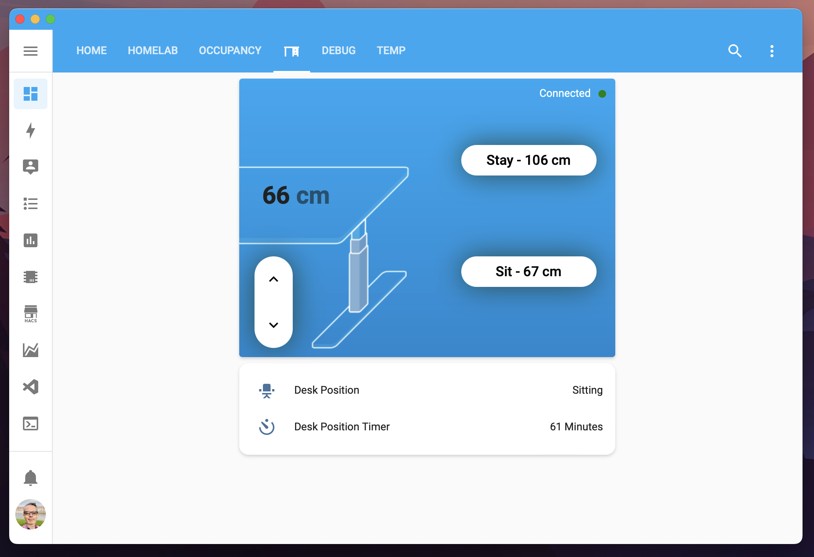
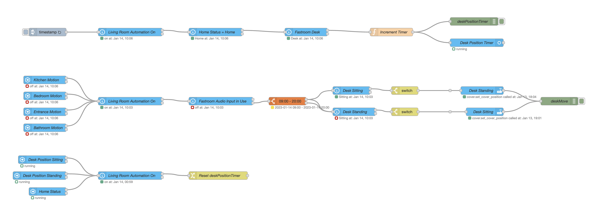
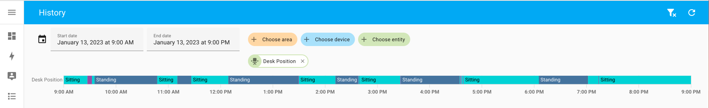

# Ikea Standing Desk Automation #

I'm using the [Ikea Idasen ESPHome Component](https://github.com/j5lien/esphome-idasen-desk-controller). The desk controls my ESP32 via Bluetooth. The component is easy to use. Just install ESPHome on HASSIO or Docker. I'm using Google Chrome for flashing the ESP, my only usage of Chrome :-). If you have controlled your desk with another device (like my Mac on my side), you need to forget this device in the Bluetooth setting.



My target was to change position between sitting and standing during the day. For now, the trigger appends after sitting during 70 minutes and 40 minutes of standing. This trigger will wait for specific conditions:

- I'm away from my computer (motion in my apartment for now, until I receive my [HC-SR04 Ultrasonic Distance Sensor](https://esphome.io/components/sensor/ultrasonic.html) ).
- Motion only append in between 9 AM and 8 PM, except the last move to the sitting position.
- Motion will not append if I'm on a call (microphone used)

Of cause, I'm using Node-Red to control this device, easier than the HA automation (from my point of view).

I create a timer using a flow variable by running every minute via an inject node and increment this flow variable if my computer is used at my desk, check the [Mac Occupancy Template](https://github.com/LucasJanin/Home/tree/main/HomeAssistant/macOccupancyTemplate).

The code: 



THe history on my desk position sensor:



My configuration for ESPhome :

```yml
substitutions:
  device_name: desk
  friendly_name: Desk

esphome:
  name: ${device_name}

esp32:
  board: esp32dev
  framework:
    type: arduino

# Enable logging
logger:

external_components:
  - source: github://j5lien/esphome-idasen-desk-controller@v4.0.0

# Enable Home Assistant API
api:
  encryption:
    key: "XXXXXXXXXXXXXXXXXXXXXXXXXXXXXXXX"

ota:
  password: "XXXXXXXXXXXXXXXXXXXXXXXXXXXXXXXX"

wifi:
  ssid: !secret wifi_ssid
  password: !secret wifi_password

  # Enable fallback hotspot (captive portal) in case wifi connection fails
  ap:
    ssid: ${friendly_name} Fallback Hotspot
    password: "XXXXXXXXXXXXXXXXXXXXXXXXXXXXXXXX"

captive_portal:

esp32_ble_tracker:

globals:
  # To store the Desk Connection Status
  - id: ble_client_connected
    type: bool
    initial_value: 'false'

ble_client:
  - mac_address: "00:00:00:00:00:00" # Replace with the desk bluetooth mac address
    id: idasen_desk
    on_connect:
      then:
        # Update the Desk Connection Status
        - lambda: |-
            id(ble_client_connected) = true;
        - delay: 5s
        # Update desk height and speed sensors after bluetooth is connected
        - lambda: |-
            id(desk_height).update();
            id(desk_speed).update();
    on_disconnect:
      then:
        # Update the Desk Connection Status
        - lambda: |-
            id(ble_client_connected) = false;

idasen_desk_controller:
  ble_client_id: idasen_desk
  only_up_down_command: false

cover:
  - platform: idasen_desk_controller
    name: "Desk"

sensor:
  # Desk Height Sensor
  - platform: ble_client
    type: characteristic
    ble_client_id: idasen_desk
    id: desk_height
    name: 'Desk Height'
    service_uuid: '99fa0020-338a-1024-8a49-009c0215f78a'
    characteristic_uuid: '99fa0021-338a-1024-8a49-009c0215f78a'
    icon: 'mdi:arrow-up-down'
    unit_of_measurement: 'cm'
    accuracy_decimals: 1
    update_interval: 30s
    notify: true
    lambda: |-
      uint16_t raw_height = ((uint16_t)x[1] << 8) | x[0];
      unsigned short height_mm = raw_height / 10;

      return (float) height_mm / 10;

  # Desk Speed Sensor
  - platform: ble_client
    type: characteristic
    ble_client_id: idasen_desk
    id: desk_speed
    name: 'Desk Speed'
    service_uuid: '99fa0020-338a-1024-8a49-009c0215f78a'
    characteristic_uuid: '99fa0021-338a-1024-8a49-009c0215f78a'
    icon: 'mdi:speedometer'
    unit_of_measurement: 'cm/min' # I'm not sure this unit is correct
    accuracy_decimals: 0
    update_interval: 30s
    notify: true
    lambda: |-
      uint16_t raw_speed = ((uint16_t)x[3] << 8) | x[2];
      return raw_speed / 100;

  - platform: wifi_signal
    name: ${friendly_name} WiFi Signal
    update_interval: 30s

  - platform: uptime
    name: ${friendly_name} Uptime

binary_sensor:
  # Desk Bluetooth Connection Status
  - platform: template
    name: 'Desk Connection'
    id: desk_connection
    lambda: 'return id(ble_client_connected);'

  # Desk Moving Status
  - platform: template
    name: 'Desk Moving'
    id: desk_moving
    lambda: 'return id(desk_speed).state > 0;'    
```

The template for determine if the desk is in sitting or standing position:

```yml
# desk_position
- platform: template
  sensors:
    desk_position:
      friendly_name: "Desk Position"
      value_template: >-
        
          Sitting
        
          Standing  
        
          Moving
        
      icon_template: >-
        
          mdi:chair-rolling
        
          mdi:desk  
        
          mdi:arrow-expand-vertical
        
```


Back to [Projects](../README.md)
